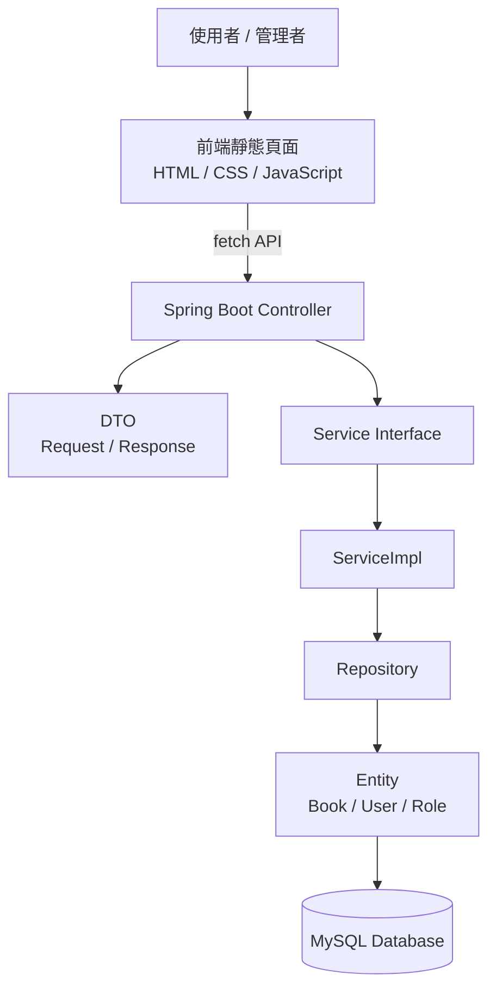
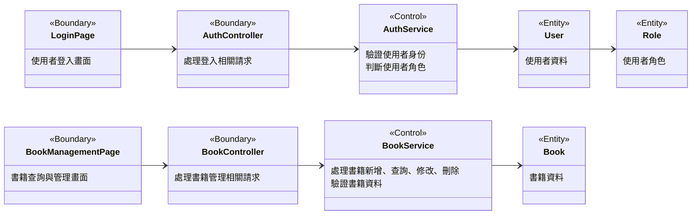
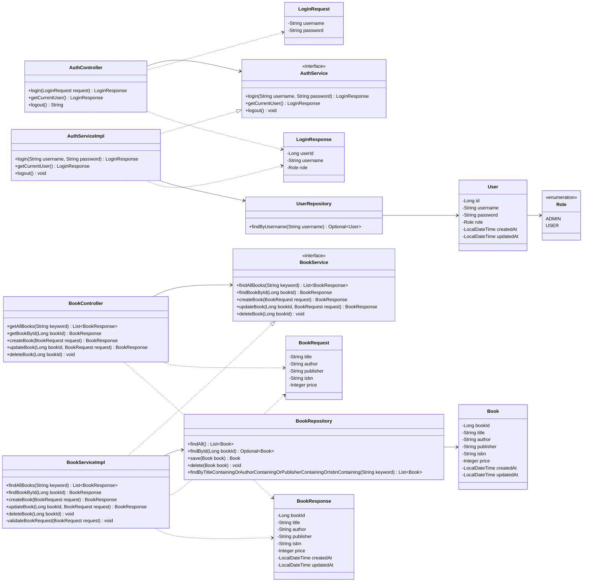
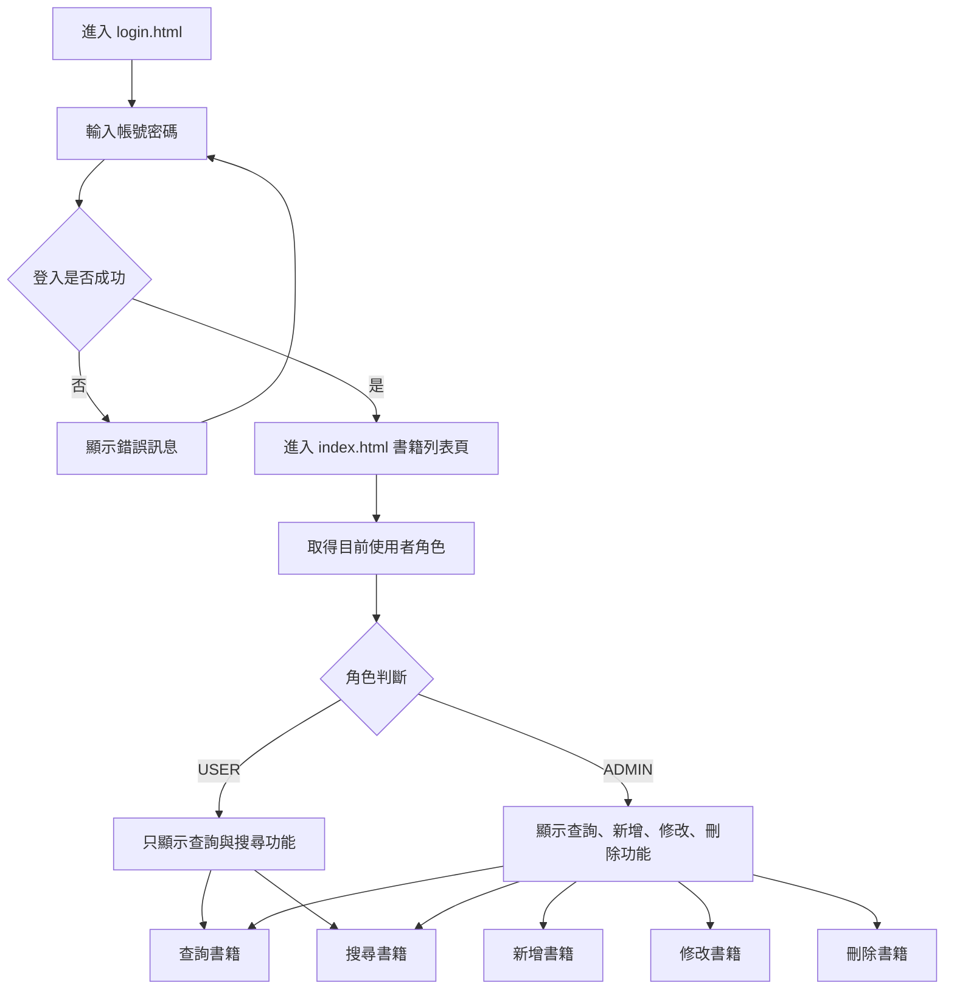
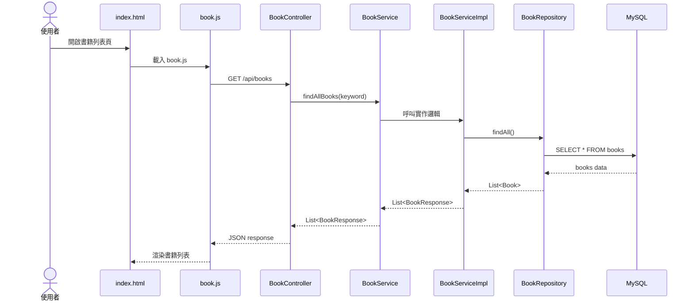
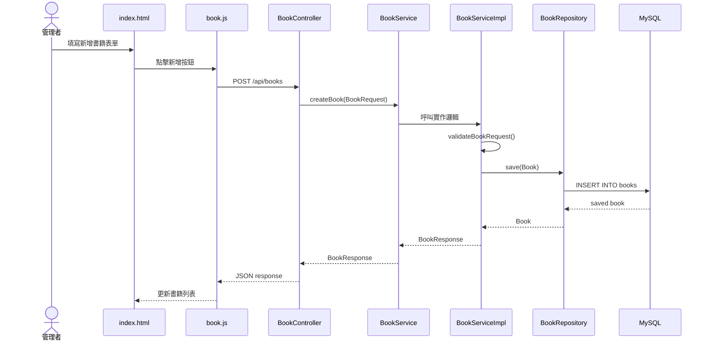
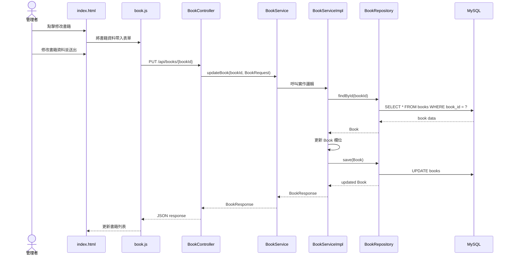
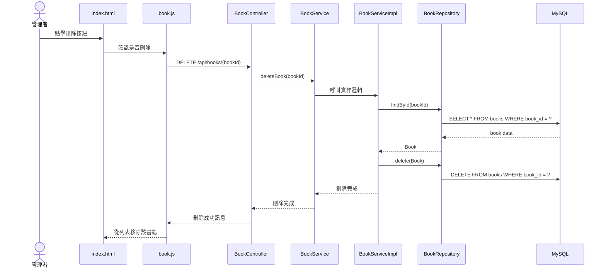

# 書庫系統 系統設計文件

## 1. 文件目的

本專案目前定位為「學生書籍訂購系統」的前置核心模組，主要功能為書籍基本資料管理，系統提供管理者維護書籍資料，並讓一般使用者查詢書籍資訊

---

## 2. 系統技術架構

| 類別 | 技術 |
|---|---|
| 後端 | Spring Boot、Java |
| 前端 | HTML、CSS、JavaScript |
| 資料庫 | MySQL |
| 資料存取 | Spring Data JPA |
| API 格式 | RESTful API |
| 權限概念 | User table + Role enum |
| 前後端架構 | 靜態頁面放置於 Spring Boot `static` 資料夾中，透過 `fetch API` 呼叫後端 REST API |
| Service 設計 | Service 介面與 ServiceImpl 實作分離 |

---

## 3. 專案整體架構

### 3.1 系統架構圖



---

### 3.2 專案資料夾架構

```text
Books-Ordering-System
├── src
│   └── main
│       ├── java
│       │   └── com.booksorderingsystem
│       │       ├── BooksOrderingSystemApplication.java
│       │       │
│       │       ├── controller
│       │       │   ├── BookController.java
│       │       │   └── AuthController.java
│       │       │
│       │       ├── service
│       │       │   ├── BookService.java
│       │       │   ├── AuthService.java
│       │       │   └── impl
│       │       │       ├── BookServiceImpl.java
│       │       │       └── AuthServiceImpl.java
│       │       │
│       │       ├── repository
│       │       │   ├── BookRepository.java
│       │       │   └── UserRepository.java
│       │       │
│       │       ├── entity
│       │       │   ├── Book.java
│       │       │   ├── User.java
│       │       │   └── Role.java
│       │       │
│       │       ├── dto
│       │       │   ├── BookRequest.java
│       │       │   ├── BookResponse.java
│       │       │   ├── LoginRequest.java
│       │       │   └── LoginResponse.java
│       │       │
│       │       └── exception
│       │           └── GlobalExceptionHandler.java
│       │
│       └── resources
│           ├── static
│           │   ├── login.html
│           │   ├── index.html
│           │   ├── css
│           │   │   └── style.css
│           │   └── js
│           │       ├── auth.js
│           │       └── book.js
│           │
│           └── application.properties
│
└── pom.xml
```

---

## 4. Service Layer 設計說明

本專案的 Service Layer 採用「介面與實作分離」的設計方式

Controller 依賴 Service 介面，而非直接依賴實作類別；實際業務邏輯則由 ServiceImpl 類別負責處理。此設計可降低模組之間的耦合度，並提高後續維護、測試與擴充的彈性。

```text
BookController → BookService interface → BookServiceImpl → BookRepository
AuthController → AuthService interface → AuthServiceImpl → UserRepository
```

---

## 5. 資料庫設計

### 5.1 books table

| 欄位名稱 | 型別 | 說明               |
|---|---|------------------|
| book_id | BIGINT | 書籍編號 Primary Key |
| title | VARCHAR | 書名               |
| author | VARCHAR | 作者               |
| publisher | VARCHAR | 出版社              |
| isbn | VARCHAR | ISBN             |
| price | INT | 價格               |
| created_at | DATETIME | 建立時間             |
| updated_at | DATETIME | 更新時間             |

---

### 5.2 users table

| 欄位名稱       | 型別 | 說明                   |
|------------|---|----------------------|
| user_id    | BIGINT | 使用者編號 Primary Key    |
| username   | VARCHAR | 使用者帳號 (Email)        |
| password   | VARCHAR | 使用者密碼                |
| role       | VARCHAR | 使用者角色 `ADMIN`、`USER` |
| created_at | DATETIME | 建立時間                 |
| updated_at | DATETIME | 更新時間                 |

---

## 6. Entity 設計

### 6.1 Book Entity

```java
public class Book {
    private Long bookId;
    private String title;
    private String author;
    private String publisher;
    private String isbn;
    private Integer price;
    private LocalDateTime createdAt;
    private LocalDateTime updatedAt;
}
```

---

### 6.2 User Entity

```java
public class User {
    private Long id;
    private String username;
    private String password;
    private Role role;
    private LocalDateTime createdAt;
    private LocalDateTime updatedAt;
}
```

---

### 6.3 Role Enum

```java
public enum Role {
    ADMIN,
    USER
}
```

---

## 7. 權限設計

| 角色 | 可使用功能 |
|---|---|
| USER | 查詢書籍、搜尋書籍 |
| ADMIN | 查詢書籍、搜尋書籍、新增書籍、修改書籍、刪除書籍 |

使用簡易登入機制進行角色判斷，登入成功後，前端根據使用者角色決定是否顯示新增、修改、刪除按鈕

---

## 8. DTO 設計

### 8.1 LoginRequest

```java
public class LoginRequest {
    private String username;
    private String password;
}
```

---

### 8.2 LoginResponse

```java
public class LoginResponse {
    private Long userId;
    private String username;
    private Role role;
}
```

---

### 8.3 BookRequest

新增與修改書籍時使用

```java
public class BookRequest {
    private String title;
    private String author;
    private String publisher;
    private String isbn;
    private Integer price;
}
```

---

### 8.4 BookResponse

查詢書籍時回傳給前端使用

```java
public class BookResponse {
    private Long bookId;
    private String title;
    private String author;
    private String publisher;
    private String isbn;
    private Integer price;
    private LocalDateTime createdAt;
    private LocalDateTime updatedAt;
}
```

---

## 9. API 說明文件

API Base URL：

```text
http://localhost:8080/api
```

---

## 9.1 Auth API

### 9.1.1 使用者登入

```http
POST /api/auth/login
```

#### 功能說明

使用者輸入帳號與密碼後，系統確認身份並回傳使用者角色。

#### Request Body

```json
{
  "username": "admin",
  "password": "1234"
}
```

#### Response Body

```json
{
  "userId": 1,
  "username": "admin",
  "role": "ADMIN"
}
```

#### 錯誤情況

| 狀態碼 | 說明 |
|---|---|
| 400 | 帳號或密碼不得為空 |
| 401 | 帳號或密碼錯誤 |

---

### 9.1.2 取得目前登入者資訊

```http
GET /api/auth/me
```

#### 功能說明

取得目前登入使用者的基本資訊。

#### Response Body

```json
{
  "userId": 1,
  "username": "admin",
  "role": "ADMIN"
}
```

---

### 9.1.3 使用者登出

```http
POST /api/auth/logout
```

#### 功能說明

登出目前使用者。

#### Response Body

```json
{
  "message": "Logout successfully"
}
```

---

## 9.2 Book API

### 9.2.1 查詢所有書籍

```http
GET /api/books
```

#### 功能說明

取得所有書籍資料。

#### Response Body

```json
[
  {
    "bookId": 1,
    "title": "Software Engineering",
    "author": "Ian Sommerville",
    "publisher": "Pearson",
    "isbn": "9780137035151",
    "price": 850,
    "createdAt": "2026-06-11T10:00:00",
    "updatedAt": "2026-06-11T10:00:00"
  }
]
```

---

### 9.2.2 依關鍵字搜尋書籍

```http
GET /api/books?keyword=software
```

#### 功能說明

依照關鍵字搜尋書籍資料。關鍵字可對應書名、作者、出版社或 ISBN。

#### Query Parameters

| 參數 | 是否必填 | 說明 |
|---|---|---|
| keyword | 否 | 可搜尋書名、作者、出版社或 ISBN |

#### Response Body

```json
[
  {
    "bookId": 1,
    "title": "Software Engineering",
    "author": "Ian Sommerville",
    "publisher": "Pearson",
    "isbn": "9780137035151",
    "price": 850,
    "createdAt": "2026-06-11T10:00:00",
    "updatedAt": "2026-06-11T10:00:00"
  }
]
```

---

### 9.2.3 查詢單本書籍

```http
GET /api/books/{bookId}
```

#### 功能說明

根據 `bookId` 查詢單本書籍詳細資料。

#### Response Body

```json
{
  "bookId": 1,
  "title": "Software Engineering",
  "author": "Ian Sommerville",
  "publisher": "Pearson",
  "isbn": "9780137035151",
  "price": 850,
  "createdAt": "2026-06-11T10:00:00",
  "updatedAt": "2026-06-11T10:00:00"
}
```

#### 錯誤情況

| 狀態碼 | 說明 |
|---|---|
| 404 | 查無此書籍 |

---

### 9.2.4 新增書籍

```http
POST /api/books
```

#### 權限

僅 `ADMIN` 可使用。

#### 功能說明

新增一本書籍資料。

#### Request Body

```json
{
  "title": "Software Engineering",
  "author": "Ian Sommerville",
  "publisher": "Pearson",
  "isbn": "9780137035151",
  "price": 850
}
```

#### Response Body

```json
{
  "bookId": 1,
  "title": "Software Engineering",
  "author": "Ian Sommerville",
  "publisher": "Pearson",
  "isbn": "9780137035151",
  "price": 850,
  "createdAt": "2026-06-11T10:00:00",
  "updatedAt": "2026-06-11T10:00:00"
}
```

#### 驗證規則

| 欄位 | 規則 |
|---|---|
| title | 不可為空 |
| author | 不可為空 |
| publisher | 不可為空 |
| isbn | 不可為空，建議不可重複 |
| price | 不可小於 0 |

---

### 9.2.5 修改書籍

```http
PUT /api/books/{bookId}
```

#### 權限

僅 `ADMIN` 可使用。

#### 功能說明

根據 `bookId` 修改書籍資料。

#### Request Body

```json
{
  "title": "Software Engineering 10th Edition",
  "author": "Ian Sommerville",
  "publisher": "Pearson",
  "isbn": "9780137035151",
  "price": 900
}
```

#### Response Body

```json
{
  "bookId": 1,
  "title": "Software Engineering 10th Edition",
  "author": "Ian Sommerville",
  "publisher": "Pearson",
  "isbn": "9780137035151",
  "price": 900,
  "createdAt": "2026-06-11T10:00:00",
  "updatedAt": "2026-06-11T10:30:00"
}
```

#### 錯誤情況

| 狀態碼 | 說明 |
|---|---|
| 400 | 輸入資料格式錯誤 |
| 403 | 權限不足 |
| 404 | 查無此書籍 |

---

### 9.2.6 刪除書籍

```http
DELETE /api/books/{bookId}
```

#### 權限

僅 `ADMIN` 可使用。

#### 功能說明

根據 `bookId` 刪除書籍資料。

#### Response Body

```json
{
  "message": "Book deleted successfully"
}
```

#### 錯誤情況

| 狀態碼 | 說明 |
|---|---|
| 403 | 權限不足 |
| 404 | 查無此書籍 |

---

# 10. 高階 BCE 類別圖

本圖用於需求分析階段，主要呈現系統中的 Boundary、Control、Entity 之間的關係。

Boundary 負責與使用者或外部系統互動，Control 負責處理系統流程與業務邏輯，Entity 則代表系統中的核心資料物件。



---

# 11. 系統設計類別圖

本圖用於系統設計階段，主要呈現 Spring Boot 專案中的實際 class 設計。

此圖不再標示 Boundary、Control、Entity，而是以實作架構為主，包含 Controller、Service interface、ServiceImpl、Repository、Entity 與 DTO。



---

## 12. UI 流程設計

### 12.1 整體 UI 流程



---

### 12.2 登入頁面 login.html

#### 頁面功能

| 功能 | 說明 |
|---|---|
| 輸入帳號 | 使用者輸入 username |
| 輸入密碼 | 使用者輸入 password |
| 登入按鈕 | 呼叫 `POST /api/auth/login` |
| 錯誤訊息 | 若登入失敗，顯示帳號或密碼錯誤 |

#### 登入成功後

```text
login.html → index.html
```

---

### 12.3 書籍列表頁 index.html

#### USER 角色可看到的功能

| 功能 | 說明 |
|---|---|
| 查詢書籍列表 | 呼叫 `GET /api/books` |
| 搜尋書籍 | 呼叫 `GET /api/books?keyword=...` |
| 查看書籍詳細資料 | 呼叫 `GET /api/books/{bookId}` |

---

#### ADMIN 角色可看到的功能

| 功能 | 說明 |
|---|---|
| 查詢書籍列表 | 呼叫 `GET /api/books` |
| 搜尋書籍 | 呼叫 `GET /api/books?keyword=...` |
| 新增書籍 | 呼叫 `POST /api/books` |
| 修改書籍 | 呼叫 `PUT /api/books/{bookId}` |
| 刪除書籍 | 呼叫 `DELETE /api/books/{bookId}` |

---

## 13. 前端與 API 串接流程

### 13.1 查詢書籍流程



---

### 13.2 新增書籍流程



---

### 13.3 修改書籍流程



---

### 13.4 刪除書籍流程



---

## 14. 主要功能與分工

| 模組 | 主要內容 |
|---|---|
| 前端 UI | `login.html`、`index.html`、`style.css` |
| 前端 API 串接 | `auth.js`、`book.js` |
| 後端 Controller | `AuthController`、`BookController` |
| 後端 Service 介面 | `AuthService`、`BookService` |
| 後端 Service 實作 | `AuthServiceImpl`、`BookServiceImpl` |
| 資料庫與 Entity | `User`、`Role`、`Book`、`UserRepository`、`BookRepository` |
| 文件與 UML | 高階 BCE 類別圖、系統設計類別圖、循序圖、API 文件、UI 流程圖 |
| 測試 | CRUD 測試、登入測試、權限測試 |

---

## 15. 開發順序建議

### Step 1：建立資料庫與 Entity

先完成：

```text
Book
User
Role
BookRepository
UserRepository
```

---

### Step 2：完成 Service Interface 與 ServiceImpl

完成：

```text
BookService
BookServiceImpl
AuthService
AuthServiceImpl
```

---

### Step 3：完成 Book CRUD API

完成：

```text
GET /api/books
GET /api/books/{bookId}
POST /api/books
PUT /api/books/{bookId}
DELETE /api/books/{bookId}
```

---

### Step 4：完成登入與角色判斷

完成：

```text
POST /api/auth/login
GET /api/auth/me
POST /api/auth/logout
```

並讓前端能根據角色顯示不同功能。

---

### Step 5：完成前端頁面

完成：

```text
login.html
index.html
style.css
auth.js
book.js
```

---

### Step 6：整合測試與 Demo

測試情境包含：

| 測試項目 | 預期結果 |
|---|---|
| 使用 ADMIN 登入 | 可以新增、修改、刪除、查詢書籍 |
| 使用 USER 登入 | 只能查詢書籍 |
| 新增空白書名 | 系統顯示錯誤 |
| 新增價格小於 0 的書籍 | 系統顯示錯誤 |
| 修改不存在的 bookId | 系統回傳查無資料 |
| 刪除書籍 | 書籍從列表中移除 |
| 搜尋關鍵字 | 系統顯示符合條件的書籍 |

---

## 16. Demo 用測試帳號

| 帳號 | 密碼 | 角色 |
|---|---|---|
| admin | 1234 | ADMIN |
| user | 1234 | USER |

---

## 17. 本專案範圍說明

本次期末專題以「書庫系統」作為主要實作範圍，著重於書籍基本資料管理、查詢與角色權限控制。

本系統目前管理的書籍資料包含書名、作者、出版社、ISBN 與價格，不包含庫存、課程、學期、訂單與付款功能。未來若要擴充為完整的「學生書籍訂購系統」，可再加入訂購紀錄、學生資料、課程資料、庫存數量與付款狀態等資料表。

未來可擴充功能包含：

| 擴充功能 | 說明 |
|---|---|
| 課程書籍對應 | 將書籍與課程建立關聯 |
| 學生訂購書籍 | 學生可選擇書籍並送出訂單 |
| 訂單管理 | 管理者可查看各書籍訂購數量 |
| 庫存管理 | 紀錄書籍庫存數量與缺書狀態 |
| 線上付款 | 串接校園無現金付款機制 |
